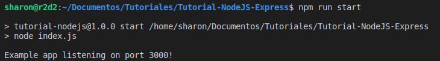
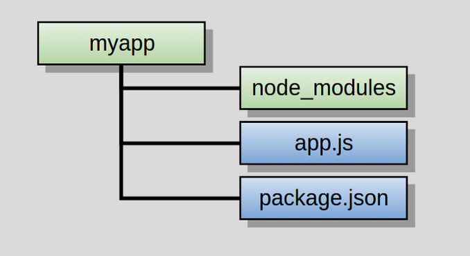

# “Hello World!” app with Node.js and Express :rocket:

<p align="center"></p>

## What is Node.js?

Node.js is an open-source and cross-platform JavaScript runtime environment. It is a popular tool for almost any kind of project!
Node.js runs the V8 JavaScript engine, the core of Google Chrome, outside of the browser. This allows Node.js to be very performant.

## Prerequisites

Before starting, we must have installed Node.js and its package manager, npm.
- [Node.js](https://nodejs.org/es/)
- [npm](https://docs.npmjs.com/downloading-and-installing-node-js-and-npm)

## Initialize your project

```bash
$ npm init
```
## Install Express

```bash
$ npm install express --save
```
After installation, in our package.json it would look like this

```javascript
{
  "name": "tutorial-nodejs",
  "version": "1.0.0",
  "description": "## What is Node.js?",
  "main": "index.js",
  "scripts": {
    "test": "echo \"Error: no test specified\" && exit 1"
  },
  "repository": {
    "type": "git",
    "url": "git+https://github.com/sharon1160/Tutorial-NodeJS.git"
  },
  "author": "",
  "license": "ISC",
  "bugs": {
    "url": "https://github.com/sharon1160/Tutorial-NodeJS/issues"
  },
  "homepage": "https://github.com/sharon1160/Tutorial-NodeJS#readme",
  "dependencies": {
    "express": "^4.17.1"
  }
}
```

## Create a file named index.js

```javascript
var express = require('express');

var app = express();app.get('/', function (req, res) {

  res.send('Hello World! :)');

});app.listen(3000, function () {

  console.log('Example app listening on port 3000!');

});
```
## Run the app

We run the following command,

```bash
$ node index.js
```
or also ...

```bash
$ npm run start
```
<p align="center"></p>

After running the command, load http://localhost:3000/ in a browser to see the output.

<p align="center"></p>

## Folder Structure 

<p align="center"></p>
