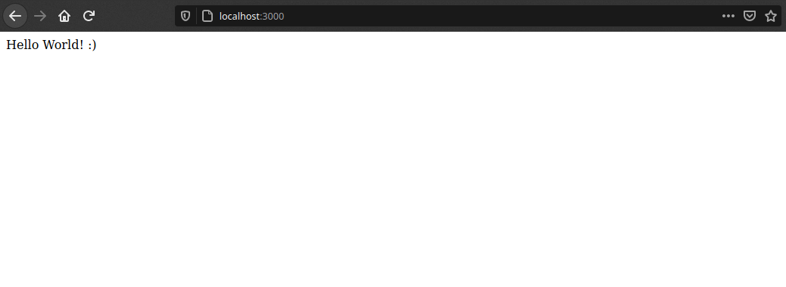

# “Hello World!” app with Node.js and Express :rocket:

<p align="center"></p>

## What is Node.js?

Node.js is an open-source and cross-platform JavaScript runtime environment. It is a popular tool for almost any kind of project!
Node.js runs the V8 JavaScript engine, the core of Google Chrome, outside of the browser. This allows Node.js to be very performant.

## Prerequisites

Before starting, we must have installed Node.js and its package manager, npm.
- [Node.js](https://nodejs.org/es/)
- [npm](https://docs.npmjs.com/downloading-and-installing-node-js-and-npm)

## Initialize your project

```bash
$ npm init
```
## Install Express

```bash
$ npm install express --save
```
## Create a file named index.js

```javascript
var express = require('express');

var app = express();app.get('/', function (req, res) {

  res.send('Hello World! :)');

});app.listen(3000, function () {

  console.log('Example app listening on port 3000!');

});
```
## Run the app

```bash
$ node index.js
```
After running the command, load http://localhost:3000/ in a browser to see the output.

<p align="center"></p>

## Folder Structure 

<p align="center"></p>
